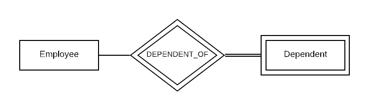

# Participation Constraints with Entities and Relationships

Written by Sam Behrens, Dana Parker, Christopher Erickson, and Tyler Fleetwood.

## Introduction
**PUT "WHY YOU SHOULD READ THIS TUTORIAL" HERE**

This tutorial will cover what participation constraints are, the two types of participation with strong entity types, weak entity participation, and degree of relationships. Upon completion of this tutorial, you should have a good understanding of how participation constraints work and be able to implement them in an ER diagram.

Throughout this tutorial, we will be using a company with employees and departments to help you understand how each participation constraint works.

### Required Understanding
Before starting this tutorial, we are assuming that you have some previous knowledge.

* What entities and relationships are

* An entity’s attributes

* What an ER diagram is and the basics of creating one

---

## Attributes as Relationships
We often think about relationships implicitly rather than explicitly—that is, one entity type contains an attribute that refers to some other entity type. For example, the SUPERVISES relationship can instead be illustrated by an attribute within Employee indicating which other Employee is its supervisor — say, a foreign key called supervisor_id. But we instead have the SUPERVISES relationship because then the relationship between the two Employees is explicitly. With ER diagrams, relating two entity types by relationships rather than just an attribute is preferable.

But why should we represent these relationships explicitly? While it may seem simpler to relate two entity types by an attribute, your ER diagram may become less clear as your database schema becomes more complex. Relationships more obviously relate two entity types because it links them together graphically. Once familiar with the notation, we can more easily understand an ER diagram related by relationships instead of attributes. The more explicit your ER diagram is, the less ambiguous the schema. Furthermore, we can place constraints on relationships to more accurately represent our database. Constraints also lend to a less ambiguous ER diagram. Both relationships and the constraints that can be placed upon them lend to a clearer and more intuitive ER diagram.

---

## Strong Entity Type Participation Constraints
For all entity types, there are two types of participation constraints:

* [Partial Participation](#partial-participation)

* [Total Participation](#total-participation)

### Partial Participation
Partial participation means that between two entities connected by a relationship, there are no requirements that one or the other must exist in the relationship. As show in Figure 1, an employee at a company may or may not be a supervisor, and an employee may or may not have a supervisor. For example, a CEO would be an employee without a supervisor. 

In an ER diagram, partial participation is represented by a single line.

*ER Diagram Example*

Figure 1. An example of partial participation.

### Total Participation
Total participation between an entity and a relationship means that that entity must exist in the relationship if the other entity exists. For example, an employee must work for a department at a company, and all departments must have employees that work in them. You cannot have a department that does not have any employees in it.

In an ER diagram, total participation is represented by a double line, as shown in Figure 2.

*ER Diagram Example*

Figure 2. An example where both entities have total participation.

### Mixing Constraints
Participation constraints do not have to be the same for both entities in a relationship. In the case of Figure 3, Department must exist in the MANAGES relationship because every department must have a manager, but an employee doesn’t have to be a manager of a department. As in the real world, not every single employee at a company is going to be a manager of a department.

*ER Diagram Example*

Figure 3. Example of an entity relationship with one partial participation and one total participation.

---

## Weak Entity Type Participation Constraints
Unlike strong entity types, weak entity types require total participation because of something called an existence dependency.

### Existence Dependencies
Recall that weak entities are dependent on the existence of a strong entity. You cannot have a weak entity exist by itself. This means that weak entities require total participation in a relationship.

### Total Participation
Since weak entities have existence dependencies, they must participate in relationships with strong entities by the definition of the existence dependency. All weak entities must have total participation with a strong entity. In Figure 4, an employee may have multiple dependents (spouse, children etc.) whose existence is solely dependent on the existence of the employee. In other words, the dependents are never going to exist on their own. They are either connected to an employee or non-existent. This means that there has to be a total participation constraint on the dependent. (See Identifying Relationship for information regarding Figure 4)

*ER Diagram Example*

Figure 4. Example of total participation in a relationship by a weak entity.

### Identifying Relationship
The relationship that a weak entity is participating in is called its identifying relationship. This is because of its existence dependency. Since a weak entity is dependent on the existence of a strong entity, it is identified by the relationship that both are participating in. In our example, the relationship, DEPENDENT_OF, is the identifying relationship for the dependent entity. The dependent has total participation with the DEPENDENT_OF relationship.

An identifying relationship is shown with a double diamond in an ER diagram.

*ER Diagram Example*

Figure 5. Example of identifying relationship in an ER diagram.

---

## Degree of Relationships

Every relationship in an ER diagram has a respective degree. The degree of a relationship is simply the number of participating entity types. For example, the WORKS_FOR relationship type (seen below) relates the entity types EMPLOYEE and DEPARTMENT, so WORKS_FOR’s degree is two. A relationship type with a degree of two is called a binary relationship; a relationship type with a degree of three is called a ternary relationship; a relationship type with a degree of N would be an N-ary relationship. An example of an N-ary relationship could be a CONTRACT in witch there is a parent entity for CUSTOMER, COMPANY, as well as a PRODUCT. Although this is a representation of a ternary degree, the idea is that any numbner of parent entities can be added to create an N-ary relationship.
 
*ER Diagram Example*

Figure 6. Example of a binary (degree two) relationship type.

---

## Conclusion

Now that you have completed this tutorial, you should have a good understanding of how participation constraints work and the different types.

Questions to think about:

* What different kinds of relationships can you build with a business model?
* What are some more examples of N-ary type relationships?
* What is an example of a strong entity type that was not covered? Weak entity type?
* Can you think of a good example of Total Participation within a school system model?
* What degree is a relationsip consisting of two entity types?

Related topics to explore next could be:

* Cardinality in relationships
* ER diagram mapping to Relational Model
* Relational Model constraints
